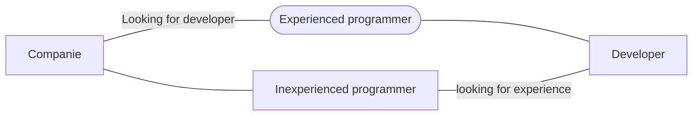

# nuTempu

This challenge boils down to: An idea to be able to add packages and track them with a **clean** and **simple** interface; and it'll also help me to learn more about API, logic, testing, architecture and the sky is the limit.

## API
I've used **Correios** **API** to get the data about all your packages;
Link to API (**docs**) -> [Correios.](https://cws.correios.com.br/ajuda)

## Technologies i've used

 - **MVVM** - Architecture choosed;
 - **Retrofit** - To get API requests;
 - **Coroutines** - Asynchronous programming;
 - **RecyclerView** - To list data;
 - **DataBinding** - To change UI data with less pollution in activity;
 - **LifeCycle** - Android lifecycle to avoid errors/crashs;

# Current state

#### That's the current state of the app, I'll try my best to keep the app true to the design and utilize all technologies i've previously listed.

### Checkboxes

 - [x]  Project idea;
 - [x]  Design;
 - [x]  Readme;
 - [x]  Project setup;
 - [x]  Gradle updated;
 - [x]  Main screen;
 - [x]  Add package screen;
 - [x]  Track package screen;
 - [x]  API connection;
 - [x]  API data;
 - [x]  Main screen redesign with API data;
 - [ ]  Track package screen redesign with ROOM/Firebase data;
 - [ ]  Clipboard to paste on Add package tracking number  {**not listed as required, it's a plus**};
 - [x]  Have the project available on Github;
 - [x]  Code refactoring;
 - [ ]  Architecture;
 - [ ]  Tests;
 - [ ]  Publish the app on Play Store {**not listed as required, it's a plus**};
 - [ ]  Loading animation{**not listed as required, it's a plus**};

## Updates with dates
> **Note:** The dates may be a little off due to forgetting to update them in real time;

**May first week** - 	*Project Idea | Design | Dependencies | Layouts*   
**May second week** - *none*  
**May third week** - *none*  
**May fourth week** - *Main screen design | Gradle updated | API connection | API data*  
 
**June first week** - *Add package screen design | Track package screen design | Main screen redesign with API data*  
**June second week** - *Firebase Authentication { SignIn and SignOut } | Firestore | SignUp; SignIn and Form screens*  
**June third week** - *To be defined*  
**June fourth week** - *To be defined*  

## Language

Which language and why did I choose?

|                |Kotlin                          |JAVA                         |
|----------------|-------------------------------|-----------------------------|
|Code			 	  |**It's not that complex**     |*A more complex and larger syntax*|            
|Popularity     	  |**It's gaining popularity after Kotlin first**            |*More popular making it easy to find guides about bugs and doubts*         |
|Community       	  |**Small community, but it's not impossible to find people**|*Huge community which makes it possible to make connections quickly* |
|NullPointerException |**The code won't work if you set it to null unless you do certain things...**|*Well well well* |

# APP Screenshot/Videos

  

  

## Diagram about companies

> Situation of companies today.

